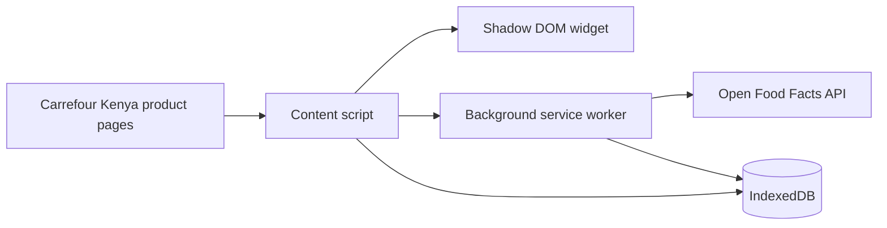

# NUTRISCORE

Chrome Extension scaffold for the NutriScore checkout tool.

## Phase 1 Deliverables

The repo now includes a Manifest V3 extension layout, a Carrefour Kenya-targeted MutationObserver scraper, a shadow-DOM content script widget, an IndexedDB persistence layer, and GitHub Actions CI for linting, type checking, and builds.

## Architecture

## Data Model

- products: product metadata, pack size, category, and source.
- scans: timestamped scrape events.
- scores: Nutri-Score letters and raw scoring details.
- history: longitudinal shopping activity.

## Setup

1. Install dependencies with npm install.
2. Run npm run lint and npm run typecheck.
3. Build the extension with npm run build.

## Scope Notes

- The initial retailer target is Carrefour Kenya.
- The inline widget is now a content script that mounts into a shadow DOM root.
- Open Food Facts is wired as the nutrition lookup source, with Kenyan market seed queries in src/data/kenya-open-food-facts-seeds.ts.
- The IndexedDB schema draft is frozen at version 1 so popup and dashboard reads can build against stable stores and indexes.
- The popup now reads live counts from IndexedDB, and the dashboard reads the same stores for the fuller inspection surface.