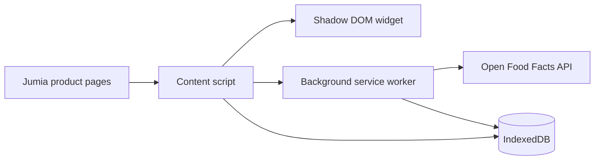

# NUTRISCORE

Chrome Extension scaffold for the NutriScore checkout tool.

## Phase 1 Deliverables

The repo now includes a Manifest V3 extension layout, a Jumia-targeted MutationObserver scraper, a shadow-DOM content script widget, an IndexedDB persistence layer, and GitHub Actions CI for linting, type checking, and builds.

## Architecture

## Data Model

- products: product metadata, pack size, category, and source.
- scans: timestamped scrape events.
- scores: Nutri-Score letters and raw scoring details.
- history: longitudinal shopping activity.

## Setup

1. Install dependencies with npm install.
2. Run npm run lint and npm run typecheck.
3. Build the extension with npm run build.

## Scope Notes

- The initial retailer target is Jumia Kenya.
- The inline widget is now a content script that mounts into a shadow DOM root.
- Open Food Facts is wired as the nutrition lookup source, with Kenyan market seed queries in src/data/kenya-open-food-facts-seeds.ts.
- The IndexedDB schema draft is frozen at version 1 so popup and dashboard reads can build against stable stores and indexes.
- The popup now reads live counts from IndexedDB, and the dashboard reads the same stores for the fuller inspection surface.
AI Engineering Prompt: Phase 1 & Master Resource Initialization
Context & Role

You are an expert Senior Browser Extension Developer and System Architect. Your task is to execute Phase 1 (Weeks 1–3) of the development plan outlined in nutriscore-phased-plan (1).pdf. The project is a Chrome Extension designed to scan e-commerce grocery pages, source nutrition metrics, and inject a visual Nutri-Score widget. The project kicks off on Monday, June 22, 2026.

Your goal in this prompt is two-fold:

    Compile and initialize the Master Resource Procurement List required for the entire project duration (Phases 1-6).

    Execute the Phase 1 Foundations & Single-Retailer Scraper via a strict, step-by-step technical implementation workflow.

Part 1: Master Resource Procurement List (Phases 1–6)

Before writing code, verify, fetch, or stub the following technical resources required across the project lifecycle:
1. Development & Build Tools (Phase 1)

    Runtime/Language: TypeScript configuration (tsconfig.json) targeting modern browser environments.

    Build Bundler: Vite or Webpack optimized for Chrome Extension environments (handling content scripts and background workers separately).

    Storage Library: The idb wrapper library npm package for clean Promise-based IndexedDB interactions.

2. Data Sourcing & Local Datasets (Phase 2 & 4)

    Primary API Access: Open Food Facts REST API documentation, endpoint URLs, and request schema for barcode/name lookups.

    Fallback Dataset Seed: A local JSON or spreadsheet structure mapped for common Kenyan consumer products to act as a load-bearing data backup.

3. UI & Frontend Libraries (Phases 3 & 5)

    Widget Framework: Preact or ultra-lightweight vanilla TS utility functions to keep the extension's injected bundle size minimal.

    Data Visualization: Chart.js or an equivalent lightweight charting library for rendering history and trends on the local dashboard.

4. Design & Compliance Assets (Phase 6)

    Design Tools: Access to Figma or Canva for drafting extension icons, promotional banners, and Chrome Web Store screenshots.

    Store Access: A Google Chrome Web Store Developer Account dashboard registration.

Part 2: Step-by-Step Phase 1 Execution Plan

Execute the foundational setup and scraper development over the next 3 weeks by following these exact sequential steps:
Step 1: Project Scaffolding & CI/CD Setup (Days 1–3)

    Initialize a Git repository and configure a standard GitHub Actions CI pipeline to run linting and TypeScript compilation checks.

    Create a Chrome Extension Manifest V3 project structure. Ensure manifest.json properly declares a content_scripts array and a background.service_worker.

    Configure the build bundler (Vite/Webpack) to output distinct, un-minified files for development debugging, ensuring code splitting doesn't break the background worker.

Step 2: Architecture Drafting (Days 4–5)

    Generate the project's formal Component Diagram immediately while the architecture is freshest.

    Map out the relationship between the DOM, the Content Script, the Background Service Worker, and the IndexedDB instance to avoid downstream integration friction.

Step 3: Local Database Layer Implementation (Week 2)

    Implement the IndexedDB schema using the idb library.

    Create explicit object stores and indexes for the following four entities:

        products: Storing name, price, pack size, and category.

        scans: Storing timestamps of scraped items.

        scores: Storing calculated Nutri-Score letters and underlying raw component points.

        history: Storing longitudinal user shopping tracking data.

    Write localized wrapper functions for CRUD operations on these stores, ensuring promise rejection handling is built-in.

Step 4: Asynchronous DOM Scraper Engine (Week 3)

    Select a prominent Kenyan online grocery platform as the initial target retailer.

    Construct a robust DOM scraper targeting product grid pages, individual detail views, and checkout/basket interfaces.

    Mandatory Anti-Fragility Measure: Because modern e-commerce architectures lazy-load content asynchronously via frameworks like React or Vue, do not rely on standard page-load triggers. Implement a MutationObserver-based approach to watch for DOM mutations dynamically.

    Ensure the scraper accurately extracts and structures three baseline data points: Product Name, Price, and Pack Size.

Part 3: Technical Constraints & Output Requirements

When writing code or generating files for this phase, you must adhere to these exact constraints:

        Manifest V3 Compliance: Absolutely zero Manifest V2 syntax. Use chrome.runtime messaging and service-worker compatible async workflows.

        Data Separation: Keep DOM-scraping selectors cleanly isolated in configuration adapters so the core scraping logic can be easily refactored into an adapter pattern in Phase 5.

        Deliverable Verification: Provide the working TypeScript boilerplate for the manifest, the service worker skeleton, the MutationObserver scraper script, the complete IndexedDB schema definition, and the architectural Component Diagram.
rewrite the inline widget as content script entry that mounts into a shadow DOM root and change the template data to real Kenyan market products(open food facts). Once done, pick Jumia as target retailer and get the repo and CI pipeline running and start scraper work. 